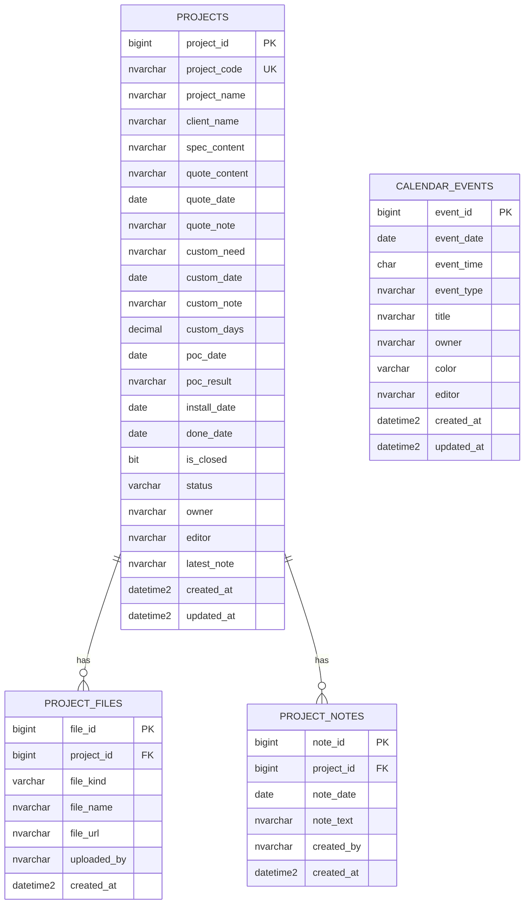

# Database Design And UI Impact

## Scope

This document maps the current data layer to the existing Vue UI and Go API in this repository.
It focuses on:

- database tables, indexes, and generated fields
- Go models and API payloads
- UI-bound fields in `frontend/src/App.vue`
- current gaps between the UI design and persisted data

## Current Data Model

### `dbo.projects`

Main project record used by the dashboard table and project creation dialog.

Key fields:

- `project_id`: primary key
- `project_code`: unique business code generated by `dbo.next_project_code()`
- `project_name`, `client_name`
- `spec_content`, `quote_content`, `quote_note`
- `quote_date`, `custom_date`, `poc_date`, `install_date`, `done_date`
- `custom_need`, `custom_note`, `custom_days`
- `poc_result`
- `is_closed`, `status`
- `owner`, `editor`
- `latest_note`
- `created_at`, `updated_at`

Indexes and rules:

- unique constraint on `project_code`
- `ix_projects_status (is_closed, status, install_date)`
- defaults for most text and audit fields
- no check constraint for `status`

### `dbo.project_files`

Attachment metadata for quote and custom files. Physical files are stored in `uploads/`.

Key fields:

- `file_id`: primary key
- `project_id`: foreign key to `dbo.projects`
- `file_kind`: currently used as `quote` or `custom`
- `file_name`, `file_url`
- `uploaded_by`, `created_at`

Indexes and rules:

- `ix_project_files_project_kind (project_id, file_kind, created_at desc)`
- no check constraint for `file_kind`
- UI only reads the latest file per `file_kind`

### `dbo.project_notes`

Prepared for note history, but not connected to the current Go models, repository, API, or UI.

Key fields:

- `note_id`: primary key
- `project_id`: foreign key to `dbo.projects`
- `note_date`, `note_text`
- `created_by`, `created_at`

### `dbo.calendar_events`

Shared calendar records used by the weekly calendar and event dialog.

Key fields:

- `event_id`: primary key
- `event_date`, `event_time`
- `event_type`, `title`
- `owner`, `color`, `editor`
- `created_at`, `updated_at`

Indexes and rules:

- `ix_calendar_events_date (event_date, event_time)`
- no lookup table or check constraint for `event_type`
- `color` is stored directly rather than derived from event type

## API And UI Binding

### Project payloads

`backend/internal/models/models.go` exposes:

- `Project`: list/detail response payload
- `ProjectInput`: create and update payload
- `UploadResult`: file upload response payload

UI-bound project fields in `frontend/src/App.vue`:

- table: `name`, `spec`, `quoteContent`, `quoteDate`, `quoteNote`, `customNeed`, `customDate`, `customNote`, `customDays`, `pocDate`, `pocResult`, `installDate`, `doneDate`, `latestNote`, `isClosed`, `status`
- display-only in table: `code`, `quoteFileName`, `quoteFileUrl`, `customFileName`, `customFileUrl`
- create dialog: `name`, `client`, `spec`, `quoteContent`, `quoteDate`, `quoteNote`, `customDate`, `customDays`, `installDate`, `customNeed`, `pocResult`, `latestNote`

Not exposed in the current project UI despite existing in the model:

- editable `owner`
- editable `editor`
- structured note history from `project_notes`

### Calendar payloads

`CalendarEvent` and `CalendarEventInput` back:

- weekly board cells
- upcoming event list
- event create/edit dialog

UI-bound event fields:

- `eventDate`, `eventTime`, `type`, `title`, `owner`, `color`, `editor`

## Mermaid ERD

## UI Change Impact Assessment

### No schema change is required for the current screen set

The current dashboard, project dialog, file upload flow, and calendar editor are already representable by the existing tables.
The current backend can persist all fields that are actually rendered in the UI.

### Data-layer gaps introduced by the current UI design

1. `status` is treated like an enum in the UI, but stored as unconstrained text in the database.
   Impact:
   a bad value breaks stage counts, filtering, and board grouping.
   Recommended change:
   add backend validation and a database `CHECK` constraint for `need`, `quote`, `poc`, `dev`, `closing`, `done`, `lost`.

2. `project_notes` exists, but the UI writes only a single `latest_note` string on `projects`.
   Impact:
   the data model suggests note history, but the product currently overwrites the latest note in place.
   Recommended change:
   if the UI is moving toward timeline-style updates, add note APIs and bind the note area to `project_notes` instead of only `latest_note`.

3. File uploads are historical in storage, but the UI shows only the newest file for each kind.
   Impact:
   the database can already support attachment history, but the user cannot browse or restore older uploads.
   Recommended change:
   no migration needed for a file-history UI, only API and UI expansion.

4. Calendar `event_type` and `color` are free-form.
   Impact:
   if the UI design standardizes event categories or wants analytics by type, inconsistent values will accumulate.
   Recommended change:
   either add a lookup table like `calendar_event_types`, or enforce a small checked value set and map colors in the UI.

5. `owner` and `editor` exist on projects, but the current project UI does not let users manage them directly.
   Impact:
   user attribution can drift to defaults such as `KC`, reducing audit value.
   Recommended change:
   if the updated UI will surface responsibility or edit ownership, no schema change is needed, but validation and visible controls should be added.

6. `done_date` is user-editable in the table, but `POST /api/projects/{id}/close` overwrites it with the current UTC date.
   Impact:
   the UI suggests manual control, while the close action enforces system-generated closure date.
   Recommended change:
   confirm product intent before adding more UI around closure workflow; this is primarily an API behavior mismatch, not a schema gap.

### Changes that would require migration if the UI grows

- multi-assignee owners or watchers: requires a relation table instead of single `owner`
- richer status workflow with ordering or permissions: likely needs a lookup table instead of plain text
- reusable customer master data: likely needs a `clients` table instead of storing `client_name` inline
- note feed with mentions, attachments, or edit history: likely needs expanding `project_notes`
- stronger analytics by quote, custom, POC, or closure stage: may require additional timestamps or event log tables

## Recommended Next Steps

Short-term, highest-value hardening:

1. add backend validation for project status, file kind, and calendar required fields
2. add database `CHECK` constraints for `projects.status` and `project_files.file_kind`
3. decide whether `latest_note` is a summary field or should be replaced by `project_notes` driven history
4. confirm whether `done_date` should remain system-generated on close
